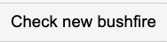
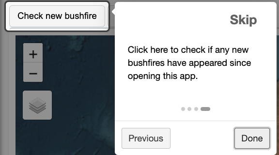
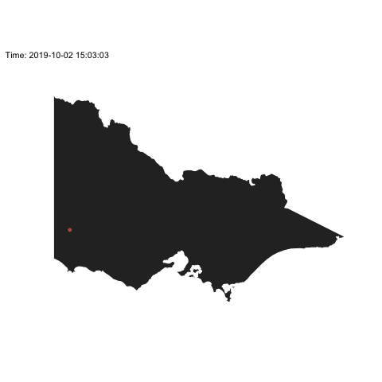
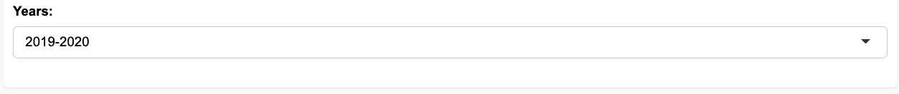
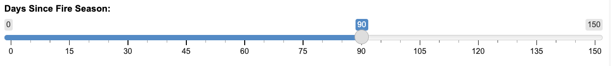
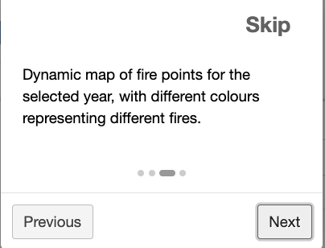

```{r setup, include=FALSE}
options(htmltools.dir.version = FALSE,
        digits = 4,
        scipen=999)
knitr::opts_chunk$set(
  fig.width=9, fig.height=3.5, 
  fig.retina=3,
  out.width = "100%",
  cache = FALSE,
  echo = FALSE,
  message = FALSE, 
  warning = FALSE,
  hiline = TRUE
)
```

```{r xaringan-themer, include=FALSE, warning=FALSE}
library(xaringanthemer)
library(xaringanExtra)
style_duo_accent(
  primary_color = "#6890B4",
  secondary_color = "#F2680C",
  inverse_header_color = "#FFFFFF",
  header_font_google = google_font("Josefin Sans"),
  text_font_google   = google_font("Montserrat", "300", "300i"),
  code_font_google   = google_font("Fira Mono")
)
```

```{css}
.box-blue {
  width: 100%;
  border-radius: 25px;
  padding: 1px 1px 1px 1px;
  margin: 0;
  background-color: #a4bcd2;
}

h4 {
  margin: 10px;
  color: #6890B4;
}

ul {
  margin: 20px;
}
```


```{r library}
library(tidyverse)
library(plotly)
library(sf)
library(hrbrthemes)
library(scales)
library(leaflet)
library(here)
library(lubridate)
library(rnaturalearth)
library(DT)
library(ggthemes)
```

```{r xaringan-animate-css, echo=FALSE}
xaringanExtra::use_animate_css()
xaringanExtra::use_panelset()
```

# 📖 Introduction

.panelset[

  .panel[.panel-name[Motivation]

### Digital Earth Australia Hotspots Website

- https://hotspots.dea.ga.gov.au/

### disadvantages

- No access to historical hotspots and bushfires.

- Expertise is required to judge new fires.

  ]

  .panel[.panel-name[Data description]
  
### Recent Hotspots Data (72 hours)

- https://hotspots.dea.ga.gov.au/data/recent-hotspots.json

### Historical Hotspots Data

- https://ga-sentinel.s3-ap-southeast-2.amazonaws.com/historic/all-data-csv.zip

  ]

]


---
class: animated, rotateInDownLeft

# 📝 Agenda

#### Current hotspots 

.box-blue[
- Live Hotspot Map
- Clustering and warning
- Data table
- User guidance
]

#### Historical hotspots

.box-blue[

- Fire season hotspots and fire maps
- Single day hotspot distribution map
- Data table
- User guidance

]


---
class: inverse, middle, center, animated, fadeIn
layout: false

# 🔥 current hotspots

---
class: animated, rotateInDownLeft

.panelset[

  .panel[.panel-name[Live Hotspot Map]
  
```{r, fig.height=7}
au_map <-ne_states(country = c("australia"), returnclass ="sf")%>%
    select(state = name, geometry)
  vic_map <- au_map%>%
    filter(state == "Victoria")
recent_hotspot_data_1 <- geojsonsf::geojson_sf("https://hotspots.dea.ga.gov.au/data/recent-hotspots.json")
  vic_hotspot1_1 <- recent_hotspot_data_1 %>%
    st_set_crs("WGS 84")
  vic_map <- vic_map %>%st_set_crs("WGS 84")
  recent_hotspot_data_1 <- recent_hotspot_data_1 %>%st_set_crs("WGS 84")
  vic_hotspot2_1 = st_intersects(vic_map$geometry, recent_hotspot_data_1$geometry)
  vic_hotspot2_1 = vic_hotspot1_1[vic_hotspot2_1[[1]],]
  hotspot_show1 <- vic_hotspot2_1%>%
    filter(confidence > 50)
  hotspot_show1$hours_since_hotspot_class <- cut(hotspot_show1$hours_since_hotspot,
                                                  breaks = c(0,2,6,24,48,72),
                                                  labels =c("0-2","2-6","6-24","24-48","48-72"))
  hotspot_show1$datetime <- str_replace(hotspot_show1$datetime,"T"," ")
  hotspot_show1$datetime <- str_replace(hotspot_show1$datetime,"Z"," ")
  hotspot_show1$datetime <- as_datetime(hotspot_show1$datetime) + dhours(10)

pals = colorFactor(palette =c("#800000","#FF0000","#FF4500","#FF8C00","#F5DEB3"),
                     levels = c("0-2","2-6","6-24","24-48","48-72"))
  
  leaflet() %>%
    setView(145,-30,zoom = 5)%>%
    # add different provider tiles
    addProviderTiles(
      "OpenStreetMap",
      # give the layer a name
      group = "OpenStreetMap"
    ) %>%
    addProviderTiles(
      "Stamen.Toner",
      group = "Stamen.Toner"
    ) %>%
    addProviderTiles(
      "Stamen.Terrain",
      group = "Stamen.Terrain"
    ) %>%
    addProviderTiles(
      "Esri.WorldStreetMap",
      group = "Esri.WorldStreetMap"
    ) %>%
    addProviderTiles(
      "Wikimedia",
      group = "Wikimedia"
    ) %>%
    addProviderTiles(
      "CartoDB.Positron",
      group = "CartoDB.Positron"
    ) %>%
    addProviderTiles(
      "Esri.WorldImagery",
      group = "Esri.WorldImagery"
    ) %>%
    # add a layers control
    addLayersControl(
      baseGroups = c(
        "Esri.WorldImagery", "Stamen.Toner",
        "Stamen.Terrain", "Esri.WorldStreetMap",
        "Wikimedia", "CartoDB.Positron","OpenStreetMap"
      ),
      # position it on the topleft
      position = "topleft"
    )%>%
      addCircleMarkers(
        data = hotspot_show1,
        radius = 4,
        color  = ~pals(hours_since_hotspot_class),
        fillOpacity = 1,
        # create custom labels
        label = paste(
          "Time: ", hotspot_show1$datetime, "<br>",
          "Hours: ",hotspot_show1$hours_since_hotspot,  "<br>",
          "Satellite:",hotspot_show1$satellite_operating_agency
        ) %>%
          lapply(htmltools::HTML)
      ) %>%
      # add a legend
      addLegend(
        colors = c("#800000","#FF0000","#FF4500","#FF8C00","#F5DEB3"),
        labels = c("0 - 2 hours","2 - 6 hours","6 - 24 hours","24 - 48 hours","48 - 72 hours"),
        title = "Hours",
        opacity = 1, 
        position = "bottomleft")
```


   
  ]


 .panel[.panel-name[Clustering and warning]
 
  .pull-left[
  



]

 .pull-right[
 
### Clustering: Spotoroo Algorithms
           
- The maximum intra-cluster spatial distance is 3km
           
- The length of time between successive time indexes is 1 hour

### Checking For New Fires

-  Check if a new fire has appeared since the application was opened

- A warning message pops up


  ]       
  
  ]
  
 .panel[.panel-name[Data table]
 

- Sort And Search
           
- Download (Excel,Pdf,Csv)

    
```{r}
data_table <- hotspot_show1%>%
  as.data.frame()%>%
  select(latitude,longitude,datetime,hours_since_hotspot,confidence)
datatable(data_table,
              rownames = FALSE,
              filter = 'top',
              caption = "Table 1: Recent VIC Hotspots",
              extensions = 'Buttons',
              options = list(dom = 'Bfrtip',
                             buttons = c('csv','excel','pdf')))
```
    
   
  ]
  
  .panel[.panel-name[User guidance]
  
- Click on the pop-up message


  


           
   
  ]

  
]

---
class: inverse, middle, center, animated, fadeIn
layout: false

# 🔙 historical hotspot

---
class: animated, rotateInDownLeft

.panelset[

  .panel[.panel-name[Fire season hotspots and fire maps]
  
.pull-left[
  


]

 .pull-right[
 
### Year selection
           
- Default shows 2021 to 2022 fire season
           
- Select range 2008-2022




### Clustering

- Different colours represent different bushfires after analysis

    
  ]       
  
  ]


 .panel[.panel-name[Single day hotspot distribution map]
 
  .pull-left[
  
```{r, fig.height=4, fig.width=5}
d <- read_csv("data/hotspot_2019_2020.csv")
ggplot() + 
  geom_density2d_filled(data=d, aes(x=lon, y=lat)) +
  geom_sf(data = vic_map, colour="white", fill=NA) +
  xlim(c(140, 150.5)) + ylim(c(-39.5, -33.5)) +
  scale_fill_grey() +
  theme_map() +
  theme(legend.position="none")+
  geom_point(d %>% dplyr::filter(date==as.Date("2019-12-21")), 
             mapping=aes(x=lon, y=lat), 
             colour="orange") 


```

]

 .pull-right[
 
### Time selection
           
- Year time varies according to the previous chart
           
- The slider indicates the number of days since the start of the fire season



### Density map

- Shows the distribution of hotspots throughout the year for the selected year
    
  ]       
  
  ]
  
 .panel[.panel-name[Data Table]
 

- Sort And Search
           
- Download (Excel,Pdf,Csv)

    
```{r}
datatable_data <- read_csv("data/hotspot_2017_2018.csv")

    datatable(datatable_data,
              rownames = FALSE,
              filter = 'top',
              caption = "Table 2: Historical Hotspots",
              extensions = 'Buttons',
              options = list(dom = 'Bfrtip',
                             buttons = c('copy','csv','excel','pdf')))

```
    
   
  ]
  .panel[.panel-name[User guidance]
  
- Click on the pop-up message


  


           
   
  ]
  
]

---
class: animated, bounceInDown

# 💻 Application

<video width="800" height="550" controls>
  <source src="www/video.mp4" type="video/mp4">
</video>

---
class: animated, bounceInDown

# 😖 Challenges

### 1. Data Cleaning

- Computer performance

- Big Data

- Missing value

### 2. Code optimisation

- Slow running applications


---
class: animated, bounceInDown

# 📌 Learning outcome

### 1. New packages

- ggthemes,rintrojs...

### 2. The importance of clustering

### 3. Ability to think and learn independently


---
class: animated, bounceInDown

# 🤔 Future Considerations

### Data cleaning optimisation

- Power

- Confidence

### Optimisation of hotspot judgements

- Power

- Confidence

### Automatic checking for new bushfires and automatic pop-up warnings


---

class: middle,animated, fadeIn

<center></center>


---
class: middle, animated, rotateInDownLeft

<center></center>


